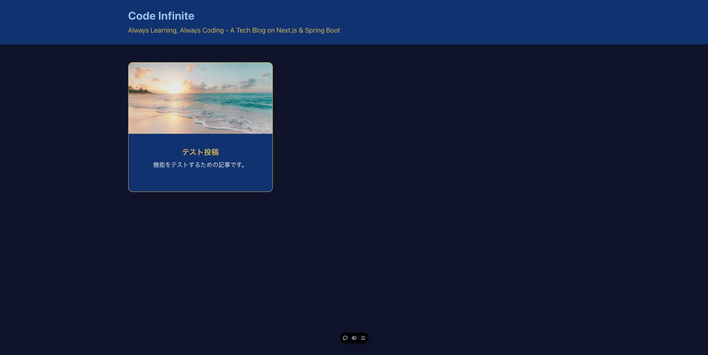
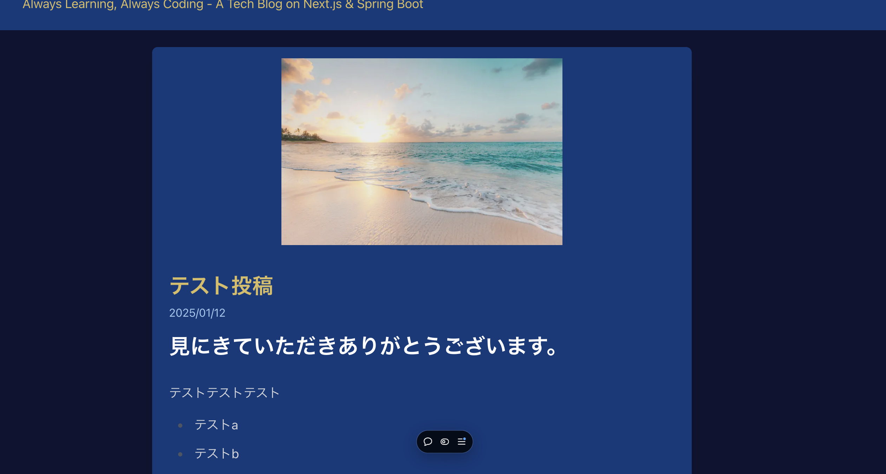
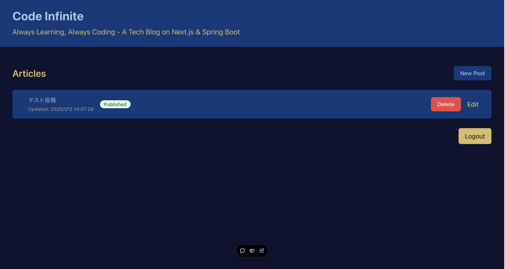
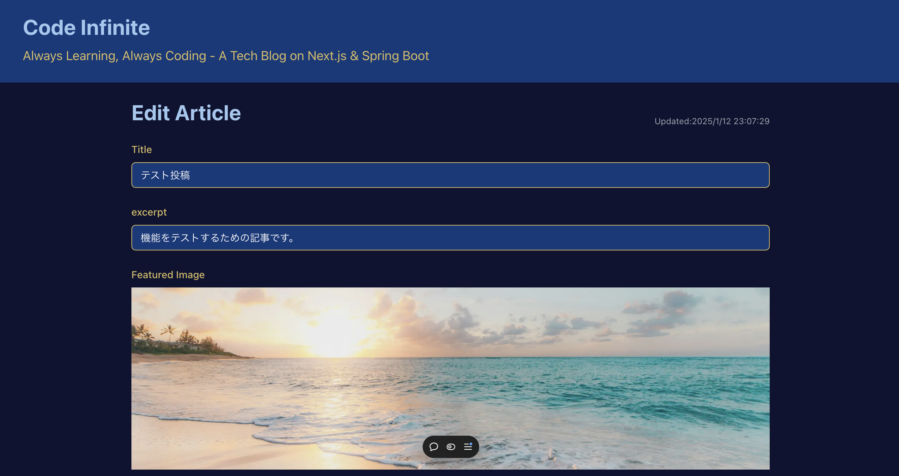
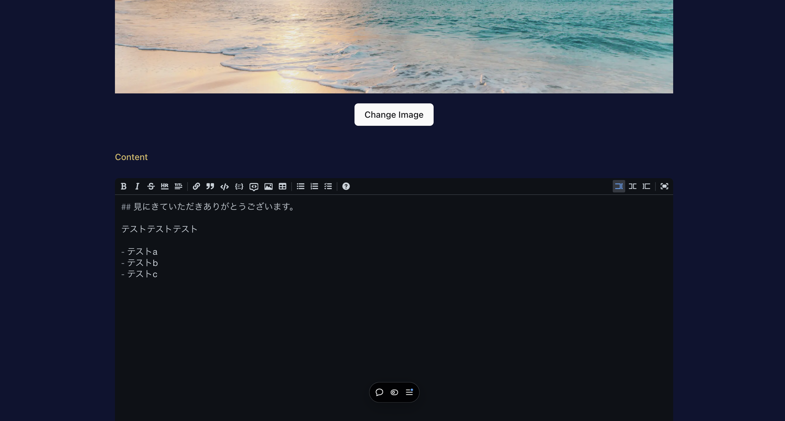
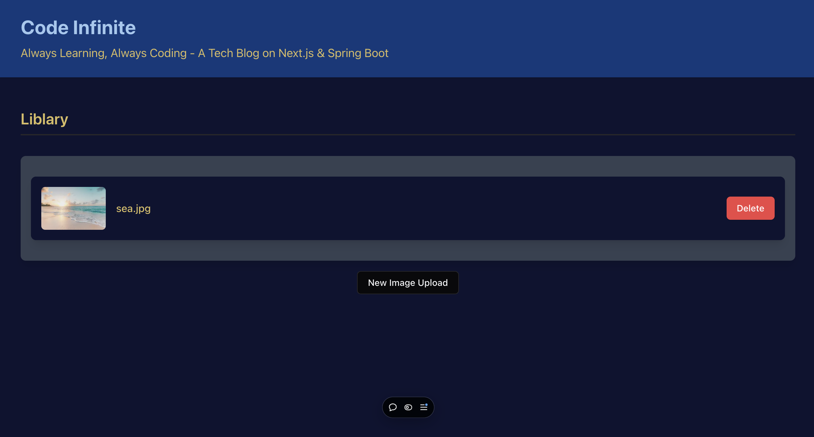

## Blog UI

フロントエンドとバックエンドに分けた初めて個人開発、DB周りのCRUD操作とアクセス制御を実装したものを目指す。

## 概要

- 目的：Web Application開発の開発の流れを抑えるため、独学でやってきた限界点を確認するため。
- 主な機能（UI）
  a\.投稿されている記事が見れるページ
  b\.指定されたユーザーのみを認可するログインページ
  c\.新規の投稿を作成するページ
  d\.投稿された記事を編集するページ
  e\.ブログ全体で扱う写真を管理するライブラリーページ

## 使用技術

**言語やフレームワークなど**

- TypeScript
- Next.js
- Auth.js

**UI**

- TailwindCSS
- shadcn
- remark（markdown形式で記事を書くため）

**デプロイ先**

- vercel

**AI（LLM）**

- Gemini2.0
- ChatGPT4o
- GitHub Copilot
- V0

## 実際のページ

### ホームページ

### 記事閲覧画面

### ダッシュボード

### 編集画面

### 画像管理画面

## 改善案

- ダッシュボードページのUIの変更

Deleteボタンを押した時に反応がページのリロードをしないと確認できない点。楽観的に表示するなどして再度情報をバックエンドから表示するように変更する。

- ライブラリーページへの遷移

ライブラリーページへの遷移を現状URIを手動で書き直す必要があるためリンクやボタンなどで変更したい。

## 反省点

- Gitのバージョン管理を最初からrebaseと --ff-only mergeを使うべきだった。
- 最初にデザインを作成しておくべきだった。
- 設計をしっかり固めてから始めるべき。
- テストコードを書くべきだった。
